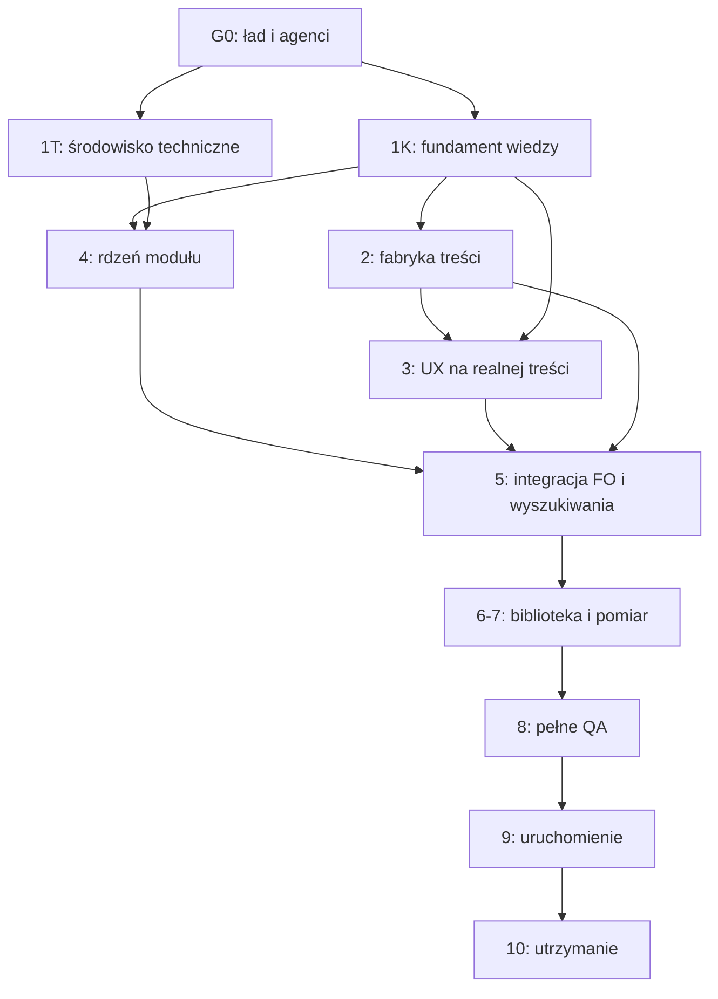

# Wykonawczy plan faz, etapów i zależności

Status: plan do zatwierdzenia w Fazie 0  
Dokument strategiczny: `docs/MASTER_PLAN.md`  
Rejestr bram: `registries/phase-gates.yaml`

## Jak czytać plan

Faza określa rezultat biznesowy. Etap określa zamknięty fragment pracy. Tor pozwala prowadzić niezależne prace równolegle. Brama jest decyzją opartą na dowodach. Numer fazy nie jest automatyczną zgodą na rozpoczęcie wszystkich jej etapów.

## Mapa zależności

## Faza 0 — Ład, plan i dopuszczenie agentów

**Gałąź:** bieżąca `agent/repository-foundation`, następnie przy kolejnych poprawkach `phase/00-governance`  
**Cel:** ustalić zasady, zależności i zweryfikować role przed pracą wykonawczą.

### Etapy

- **0.1 Katalog decyzji:** zakres, zakazy, grupa odbiorców, AI, e-mail, korekty, analityka, przypadki.
- **0.2 Fundament repozytorium:** instrukcje, konstytucja, ADR, rejestry i mapa.
- **0.3 Strategia wykonania:** gałęzie, blokady, środowiska, fazy i bramy.
- **0.4 Audyt konstrukcji 27 agentów:** wejścia, wyjścia, narzędzia, zakazy, testowalność.
- **0.5 Audyty krzyżowe:** kontekst, dowody, bezpieczeństwo, technika, dostępność, SEO i grafiki.
- **0.6 Korekta struktury:** poprawa, podział, połączenie lub zawieszenie ról.
- **0.7 Kontrakty wykonywalne:** schematy wejść/wyjść, checklisty, fixture i raporty.
- **0.8 Symulacja:** syntetyczny przepływ przez co najmniej trzy sąsiednie role.
- **0.9 Akceptacja właściciela:** zatwierdzenie planu i struktury.

**Brama G0:** role potrzebne w następnych torach dopuszczone, brak krytycznych sprzeczności, plan zaakceptowany.

## Faza 1K — Fundament wiedzy

**Gałąź:** `phase/01-knowledge-foundation`  
**Może ruszyć po:** G0  
**Nie wymaga:** gotowego PrestaShop.

### Etapy

- **1K.1 Słownik i zasady nazewnictwa.**
- **1K.2 Taksonomia oczek, stawów, wody, techniki, roślin, sezonowości i ryb.**
- **1K.3 Typy artykułów i ich wymagane sekcje.**
- **1K.4 Model twierdzeń, źródeł, cytowania, pewności i ryzyka.**
- **1K.5 Statusy widoczności, redakcji, weryfikacji i aktualności.**
- **1K.6 Model korekt, podziękowań i historii zmian.**
- **1K.7 Minimalny model przyszłych przypadków bez uruchamiania forum.**
- **1K.8 Schemat pakietu badawczego i publikacyjnego.**
- **1K.9 Fixture reprezentujące wodę, gatunek, problem zdrowotny i technikę.**
- **1K.10 Walidacja schematów i audyt A40/A41/A82.**

**Brama G1K:** schematy są walidowalne, wysokie ryzyko oznaczane, brak relacji produktowych, fixture pokrywają różne typy treści.

## Faza 1T — Fundament środowiska technicznego

**Gałąź:** `phase/01t-technical-environment`  
**Może ruszyć po:** G0  
**Może działać równolegle z:** Fazą 1K.

### Etapy

- **1T.1 Macierz wersji PrestaShop 9, PHP, bazy i narzędzi.**
- **1T.2 Powtarzalne środowisko DEV bez sekretów.**
- **1T.3 Środowisko TEST i syntetyczna baza.**
- **1T.4 Standardy kodu, struktury modułu, logowania i konfiguracji.**
- **1T.5 CI: lint, analiza statyczna, testy, walidacja plików i sekretów.**
- **1T.6 Procedury backup, restore, migracji i rollbacku.**
- **1T.7 Niezależne odtworzenie środowiska przez A80.**

**Brama G1T:** ENV-DEV i ENV-TEST mają status `READY`.

## Faza 2 — Fabryka badań i treści

**Gałąź:** `phase/02-content-pipeline`  
**Może ruszyć po:** G1K  
**Równolegle:** badania domenowe mogą działać równolegle na rozłącznych pakietach.

### Etapy

- **2.1 Przyjęcie i niezmienny zapis surowego badania.**
- **2.2 Katalogowanie twierdzeń, źródeł, luk i ryzyka.**
- **2.3 Rozdział do specjalistów A20–A24.**
- **2.4 Plan portfela i podział na artykuły przez A30.**
- **2.5 Redakcja merytoryczna A31.**
- **2.6 Prezentacja i czytelność A32.**
- **2.7 Audyt dowodów A40 i bezpieczeństwa A41.**
- **2.8 Korekta we właściwym etapie, bez cichego nadpisania.**
- **2.9 Pakiet publikacyjny i raport kompletności.**
- **2.10 Pełny przebieg pilotażowy na reprezentatywnym badaniu.**

**Punkt odblokowujący UX:** zaakceptowany wynik 2.9 dla minimum trzech różnych typów artykułu.  
**Brama G2:** pełny workflow działa, przekazania są wersjonowane, status weryfikacji ma dowody.

## Faza 3 — Architektura informacji, system wizualny i makiety

**Gałąź:** `phase/03-ux-design-system`  
**Może ruszyć częściowo po:** G1K  
**Makiety treściowe wymagają:** punktu odblokowującego UX z Fazy 2.

### Etapy

- **3.1 Architektura informacji i główne ścieżki użytkownika.**
- **3.2 Wireframes bez stylizacji.**
- **3.3 Kierunek wizualny: spokojny, nowoczesny, profesjonalny.**
- **3.4 Tokeny kolorów, typografii, odstępów, siatki i stanów.**
- **3.5 Komponenty oraz ikony bez emoji.**
- **3.6 Makiety HTML strony głównej, kategorii, wyników, artykułu, gatunku, korekt i współtworzenia.**
- **3.7 Zasoby wizualne A60 oraz kontrola praw A61.**
- **3.8 Testy na rzeczywistej treści, mobile i desktop.**
- **3.9 Audyt WCAG 2.2 AA przez A81.**
- **3.10 Korekta i akceptacja właściciela.**

**Brama G3:** zatwierdzone widoki, komponenty i zachowania responsywne; brak krytycznych problemów dostępności.

## Faza 4 — Rdzeń modułu PrestaShop

**Gałąź:** `phase/04-prestashop-core`  
**Może ruszyć po:** G1K i G1T  
**Może działać równolegle z:** Fazą 2 i 3 w zakresie Back Office oraz modelu danych.

### Etapy

- **4.1 ADR architektury modułu i granic odpowiedzialności.**
- **4.2 Encje, własne tabele, indeksy i mapowanie schematów.**
- **4.3 Instalacja, aktualizacja, migracje i odinstalowanie.**
- **4.4 Role i uprawnienia Back Office.**
- **4.5 Formularze oraz workflow statusów.**
- **4.6 Import walidowany, idempotentny i wersjonowany.**
- **4.7 Historia, wycofanie i ochrona przed utratą danych.**
- **4.8 Publiczne trasy i techniczna gotowość wielojęzyczna.**
- **4.9 Testy bezpieczeństwa, migracji i uprawnień A80/A41.**

**Brama G4:** instalacja oraz aktualizacja są odtwarzalne, dane chronione, brak zmian core, import nie dubluje rekordów.

## Faza 5 — Front Office, wyszukiwarka i odkrywanie

**Gałąź:** `phase/05-frontoffice-search`  
**Może ruszyć po:** G2, G3 i G4.

### Etapy

- **5.1 Implementacja zaakceptowanych komponentów Front Office.**
- **5.2 Rendering artykułów, gatunków, statusów i korekt.**
- **5.3 Wyszukiwanie pełnotekstowe, synonimy, literówki i nazwy naukowe.**
- **5.4 Filtry, breadcrumbs, powiązania i puste wyniki.**
- **5.5 Rejestr wyszukiwań bez wyniku bez zbędnych danych osobowych.**
- **5.6 URL, canonical, sitemap i dane strukturalne.**
- **5.7 Audyty A81, A82 i A80.**

**Brama G5:** reprezentatywne zapytania zwracają oczekiwane treści, widoki są zgodne z makietami i dostępne.

## Faza 6 — Biblioteka startowa

**Gałąź:** `phase/06-launch-library`  
**Może ruszyć produkcyjnie po:** G2 i G5.

### Etapy

- **6.1 Macierz pokrycia kategorii i priorytetów.**
- **6.2 Partie badań i artykułów.**
- **6.3 Grafiki oraz rejestr praw.**
- **6.4 Audyty wysokiego ryzyka.**
- **6.5 Import do STAGE, podgląd i korekta.**
- **6.6 Kontrola pustych działów, linków, statusów i aktualności.**
- **6.7 Zamrożenie kandydatki biblioteki startowej.**

**Brama G6:** każda publiczna kategoria ma wartościową treść; wszystkie materiały mają źródła, status i historię.

## Faza 7 — Analityka, kontakt i korekty

**Gałąź:** `phase/07-feedback-analytics`  
**Projekt zdarzeń może ruszyć po:** G1K i G1T  
**Integracja produkcyjna wymaga:** G5.

### Etapy

- **7.1 Katalog zdarzeń z celem, właścicielem i retencją.**
- **7.2 Zgody, pseudonimizacja i rozdzielenie danych kontaktowych.**
- **7.3 Logiczny magazyn analityczny i raport luk wiedzy.**
- **7.4 Procedura e-maili, zdjęć, pytań i uwag.**
- **7.5 Workflow korekty, ponownej weryfikacji i komunikatu z datą.**
- **7.6 Podziękowanie z nazwiskiem wyłącznie po właściwej zgodzie.**
- **7.7 Audyt A24/A41/A80.**

**Brama G7:** każde zdarzenie ma uzasadnienie, istnieje retencja i usunięcie, dane kontaktowe nie są mieszane z analityką.

## Faza 8 — Pełne testy przed uruchomieniem

**Gałąź:** `phase/08-release-qualification`  
**Może ruszyć po:** G6 i G7.

### Etapy

- **8.1 Funkcjonalność i regresja.**
- **8.2 Bezpieczeństwo, prywatność i uprawnienia.**
- **8.3 WCAG, responsywność i przeglądarki.**
- **8.4 SEO, wyszukiwarka, linki i dane strukturalne.**
- **8.5 Wydajność i zachowanie pod błędnymi danymi.**
- **8.6 Migracje, import, backup, restore i rollback.**
- **8.7 Audyt treści, źródeł, grafik oraz komunikatów AI.**
- **8.8 UAT właściciela i lista znanych ograniczeń.**

**Brama G8:** brak błędów krytycznych i wysokich; ograniczenia zaakceptowane; rollback udowodniony.

## Faza 9 — Uruchomienie

**Gałąź:** `release/<wersja>`  
**Może ruszyć po:** G8 i jawnej zgodzie właściciela.

### Etapy

- **9.1 Zamrożenie zakresu i wersji.**
- **9.2 Kopia zapasowa oraz kontrola gotowości.**
- **9.3 Wdrożenie.**
- **9.4 Smoke test i weryfikacja indeksowania.**
- **9.5 Monitoring oraz decyzja kontynuować/wycofać.**
- **9.6 Raport powdrożeniowy.**

**Brama G9:** produkcja stabilna albo bezpiecznie wycofana; stan repozytorium odpowiada wdrożeniu.

## Faza 10 — Utrzymanie

**Gałązie:** małe `agent/10-...`, `fix/10-...` i okresowe gałęzie integracyjne  
**Może ruszyć po:** G9.

Etapy cykliczne: monitoring aktualności, przegląd źródeł, korekty, nowe treści, analiza zapytań bez wyniku, audyty agentów i skilli, aktualizacje modułu oraz raporty jakości.

## Faza 11 — Moderowana biblioteka przypadków

Model minimalny jest przygotowany wcześniej, ale rozwój funkcji pozostaje `BLOCKED` do osobnego ADR i zgody właściciela. Nie jest to publiczne forum.

## Tory, które mogą działać równolegle

| Tor | Start | Granica równoległości |
|---|---|---|
| Wiedza 1K | G0 | nie potrzebuje PrestaShop |
| Środowisko 1T | G0 | implementacja danych czeka na G1K |
| Badania 2 | G1K | publikacja czeka na moduł i UX |
| UX 3 | G1K | pełne makiety czekają na próbki z 2 |
| Rdzeń modułu 4 | G1K + G1T | Front Office czeka na G3 |
| Analityka projektowa 7 | G1K + G1T | integracja czeka na G5 |

## Reguła zmiany planu

Nowy agent, tor, etap lub zależność może zostać dodany. Nie robimy tego jednak przez cichą zmianę kolejności. A00 wykonuje analizę wpływu, aktualizuje rejestry, a dla istotnej zmiany tworzy ADR i przedstawia decyzję właścicielowi.
